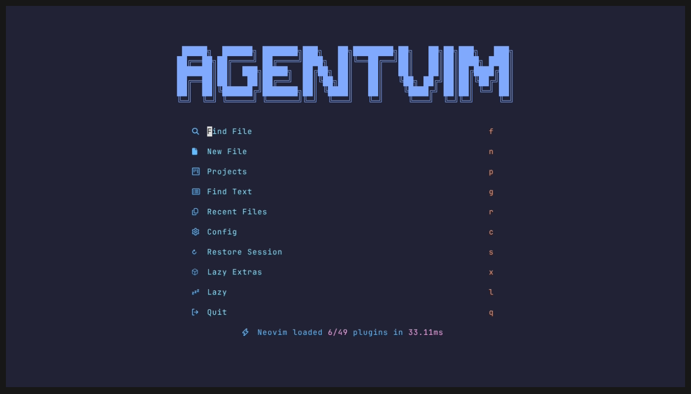
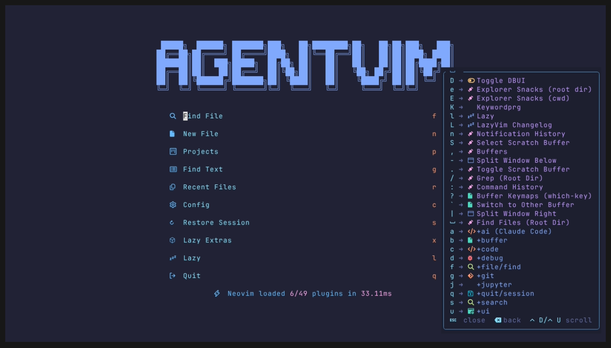

# AgentVim

> An AI-first Neovim distribution for people leaving VSCode.

[](https://github.com/4arkeinlvy/agentvim/actions/workflows/ci.yml)
[](LICENSE)
[](https://neovim.io)

AgentVim turns Neovim into an **AI command center**: Claude Code integrated at
the editor level (native diffs, selection context, same protocol as the VSCode
extension), terminal-first orchestration for Codex / Gemini / any CLI agent,
and first-class support for the workflows AI and backend engineers actually
have — Python, TypeScript/React, notebooks, LaTeX, Docker, Kubernetes YAML,
SQL, and Markdown as a context language.

Built on [LazyVim](https://github.com/LazyVim/LazyVim) rather than from
scratch — you get a battle-tested base maintained by the ecosystem's core
contributors, plus a small, fully documented AI/notebook/LaTeX layer on top.
**Startup: ~25 ms.**



<details>
<summary>More: which-key discovery · fuzzy find & grep (GIF)</summary>




</details>

## Why this exists

- VSCode + AI extensions is heavy and mouse-driven. Terminal agents (Claude
  Code, Codex, Gemini CLI) are the new center of gravity — and Neovim lives in
  the terminal with them.
- Most Neovim configs treat AI as an afterthought. AgentVim treats agent
  orchestration as the primary workflow and documents it.
- Every dependency justifies its existence in writing
  ([docs/architecture.md](docs/architecture.md)). No plugin soup.

## Features

- **Claude Code, integrated** — `Space a c` opens Claude beside your code; it
  sees your file/selection, proposes edits as native Neovim diffs you
  accept/reject with two keys. Your existing `~/.claude` setup and MCP servers
  work unchanged.
- **Multi-agent orchestration** — documented tmux patterns for running
  Claude + Codex + Gemini side by side on one repo without context conflicts.
- **Full LSP stack, zero setup** — Python (Pyright + Ruff), TypeScript/React
  (vtsls), Tailwind, Docker, YAML/Kubernetes, JSON, SQL, Lua, LaTeX, Markdown.
  Auto-installed via Mason, formatted on save.
- **Notebooks** — open `.ipynb` as clean Markdown (jupytext), run cells
  against per-project kernels (molten), keep diffs reviewable.
- **LaTeX** — VimTeX + latexmk + SyncTeX: compile on save, jump PDF↔source.
- **Modern UX** — fuzzy finder, file explorer, which-key discovery, lazygit,
  floating terminal, debugger (DAP), Tokyo Night everywhere including the
  bundled kitty terminal config.

## Requirements

- Neovim ≥ 0.11 (installer provides the latest stable)
- git, curl, tar; Node.js ≥ 18 and Python 3.9+ for language servers/notebooks
- A [Nerd Font](https://www.nerdfonts.com) (installer provides JetBrainsMono)
- [Claude Code](https://claude.com/claude-code) CLI for the AI integration

## Install

**Automated (Linux x86_64, macOS via Homebrew):**

```bash
curl -fsSL https://raw.githubusercontent.com/4arkeinlvy/agentvim/main/scripts/install.sh | bash
```

The installer backs up any existing `~/.config/nvim` before touching it, and
`scripts/uninstall.sh` restores it. Windows: use WSL2, or follow the manual
steps in [docs/installation.md](docs/installation.md).

**Manual:**

```bash
mv ~/.config/nvim ~/.config/nvim.bak 2>/dev/null || true
git clone https://github.com/4arkeinlvy/agentvim ~/.config/nvim
nvim   # first launch installs plugins + language servers; give it a minute
```

Then run `:checkhealth` and read [docs/usage.md](docs/usage.md).

## Quick start

| Key | Action |
|---|---|
| `Space` (wait) | Discover every keybinding (which-key) |
| `Space Space` | Find file |
| `Space /` | Grep the project |
| `Space e` | File explorer |
| `Ctrl+/` | Floating terminal |
| `Space a c` | **Claude Code** |
| `Space a a` / `Space a d` | Accept / reject Claude's diff |
| `Space g g` | Lazygit |
| `gd` / `K` / `Space c r` | Definition / docs / rename |

Coming from VSCode? The full shortcut map is in
[docs/vscode-migration.md](docs/vscode-migration.md).

## Documentation

| Doc | What |
|---|---|
| [usage.md](docs/usage.md) | The daily-driving manual (start here) |
| [learning-path.md](docs/learning-path.md) | 10-day progressive course from zero Vim |
| [vscode-migration.md](docs/vscode-migration.md) | Feature/shortcut/mindset mapping |
| [ai.md](docs/ai.md) | AI architecture; Claude Code vs Codex vs Gemini vs Avante vs CodeCompanion |
| [agent-orchestration.md](docs/agent-orchestration.md) | Running multiple agents on one repo |
| [context.md](docs/context.md) | Context engineering: CLAUDE.md, AGENTS.md, ADRs, project memory |
| [mcp.md](docs/mcp.md) | MCP server presets (Playwright, Postgres, GitHub, K8s) |
| [workflows.md](docs/workflows.md) | End-to-end engineering workflows (FastAPI, React, K8s, notebooks…) |
| [architecture.md](docs/architecture.md) | Why every major dependency was chosen |
| [plugins.md](docs/plugins.md) | Full plugin decision matrix |
| [installation.md](docs/installation.md) | Manual install, per-OS notes, what the scripts do |
| [performance.md](docs/performance.md) | Measured startup, methodology, optimization |
| [maintenance.md](docs/maintenance.md) | Updating, rollback, recovery, pinning |
| [philosophy.md](docs/philosophy.md) | Design principles |

## Credits

Standing on the shoulders of [LazyVim](https://github.com/LazyVim/LazyVim)
(Apache-2.0), [claudecode.nvim](https://github.com/coder/claudecode.nvim),
[molten-nvim](https://github.com/benlubas/molten-nvim),
[jupytext.nvim](https://github.com/GCBallesteros/jupytext.nvim),
[VimTeX](https://github.com/lervag/vimtex), and the wider Neovim ecosystem.

MIT — see [LICENSE](LICENSE).
