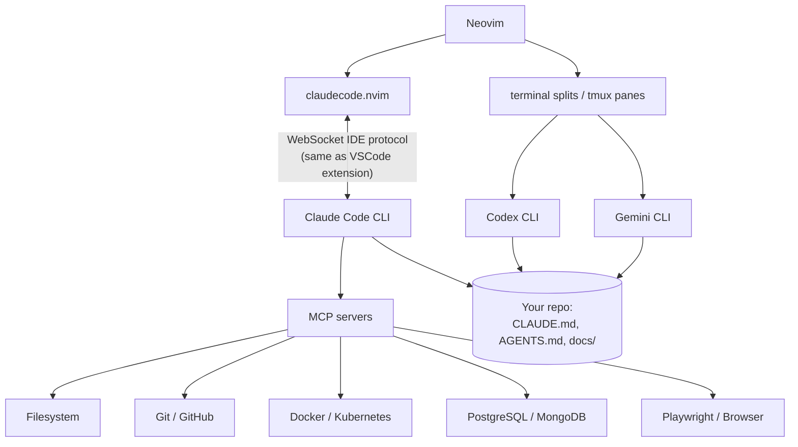

# AI Architecture

AgentVim's core bet: **the agent CLI is the product; the editor's job is to
integrate it, not re-implement it.** You already have a configured Claude
Code (or Codex, or Gemini CLI) with auth, MCP servers, memory, and project
instructions. The editor should plug into that — not run a second,
differently-configured AI with its own API keys.

## The architecture

Two integration tiers:

1. **Protocol tier (Claude Code).** claudecode.nvim implements the WebSocket
   protocol Anthropic's VSCode extension uses. Claude knows your open file,
   cursor, and selection; proposed edits arrive as native Neovim diff views
   you accept (`Space a a`) or reject (`Space a d`) — never blind file
   overwrites.
2. **Terminal tier (everything else).** Codex, Gemini, opencode, anything —
   run in a split (`Ctrl+/`) or tmux pane. Neovim is a terminal app, so a
   terminal agent sitting next to your buffers *is* integration; there's no
   iframe-in-sidebar indirection like VSCode. Context flows through the repo
   itself (see [context.md](context.md)).

MCP servers configured for the Claude CLI (`claude mcp add …` or
`.mcp.json`) work in Neovim automatically — the plugin launches the same CLI.

## Tool comparison

| Tool | What it is | Strengths | Weaknesses | Verdict in AgentVim |
|---|---|---|---|---|
| **Claude Code** | Agentic CLI + IDE protocol | Repo-scale reasoning, MCP ecosystem, CLAUDE.md memory, subagents, native diff integration in Neovim | Paid | **Primary agent** (integrated) |
| **OpenAI Codex CLI** | Agentic CLI | Strong implementation/optimization work; sandboxed exec | No editor protocol; separate context conventions (AGENTS.md) | Second opinion / parallel worker in a pane |
| **Gemini CLI** | Agentic CLI | Huge context window, generous free tier | Younger tooling ecosystem | Bulk-context tasks: repo-wide summaries, log analysis |
| **GitHub Copilot** | Inline completion + chat | Best-in-class ghost-text completions | Not agentic; subscription; overlaps with agents | Optional — add via `:LazyExtras` (`ai.copilot`) if you want ghost text |
| **Avante.nvim** | In-editor agent (Cursor-style) | Nice UX, provider-agnostic | Re-implements the agent loop inside the editor; separate API keys, no MCP parity, you maintain its config | Not included — duplicates Claude Code with less capability |
| **CodeCompanion.nvim** | In-editor chat/agent framework | Flexible, well built, provider-agnostic | Same duplication argument; strongest when you *don't* use an agent CLI | Not included; the right choice if you're API-key-only |
| **Supermaven / others** | Completion engines | Fast | Same niche as Copilot | Not included |

**When to use which:**

- *Feature work, refactors, debugging, review* → Claude Code in the editor
  (`Space a c`), because diff-review keeps you in control.
- *Parallel second implementation or a cross-check* → Codex in a tmux pane on
  the same repo (read-only or on a branch — see
  [agent-orchestration.md](agent-orchestration.md)).
- *"Read this 200k-line log / summarize this whole repo"* → Gemini CLI.
- *You only have API keys, no agent subscription* → install CodeCompanion;
  everything else in this distro still applies.

## Capabilities checklist (how each need is met)

| Need | How |
|---|---|
| Chat | `Space a c` panel (Claude), terminal panes (others) |
| Inline / selection edits | Visual select → `Space a s`, then instruct |
| Multi-file editing | Agent edits land as diffs per file; accept/reject each |
| Repo understanding | Agent CLIs index/grep the repo natively; `CLAUDE.md` steers it |
| Planning | Claude Code plan mode (`Shift+Tab` in the panel) |
| Refactoring / docs / review | Documented per-workflow in [workflows.md](workflows.md) |
| Git-aware suggestions | Agents run `git` themselves; lazygit for the human side |
| Prompt history | `Space a r` (resume) / `Space a C` (continue) — CLI-native sessions |
| Context awareness | Protocol tier: automatic. Terminal tier: [context.md](context.md) conventions |
